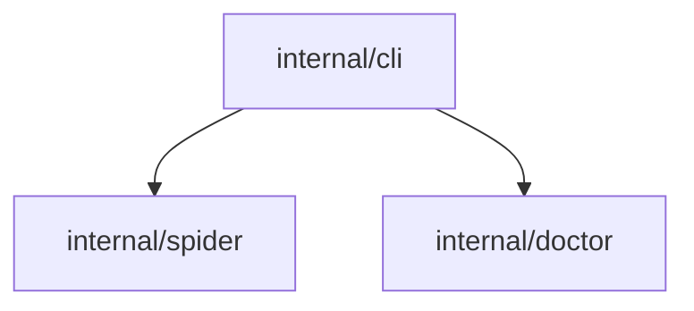

# Codebase Scanner Design

**Date**: 2026-04-17
**Feature**: Static codebase analysis — public API surface + import graph

## Problem

To identify gaps between a codebase and its documentation, find-the-gaps needs a
structured model of the codebase: what symbols are exported, how files depend on
each other, and how packages cluster into higher-level components. This is pure
static analysis — no LLM involvement. A separate architect phase (future) consumes
this output alongside the docs crawl to infer features and find gaps.

## Scope

This design covers the **scanner only**. Architecture inference and feature-to-docs
pairing are out of scope here and belong to a future architect phase.

## Package Structure

```
internal/scanner/
    scanner.go      # Scan() orchestrator: walk → parse → graph → cache → report
    walker.go       # gitignore-aware recursive file walker
    symbols.go      # data types: ProjectScan, ScannedFile, Symbol, Import, ImportGraph
    cache.go        # read/write scan cache (.find-the-gaps/scan-cache/scan.json)
    graph.go        # builds ImportGraph from []ScannedFile
    report.go       # generates project.md from ProjectScan
    lang/
        detect.go       # extension → Extractor mapping
        extractor.go    # Extractor interface
        go.go           # Go tree-sitter queries (Priority 1)
        python.go       # Python queries (Priority 1)
        typescript.go   # TypeScript/JavaScript queries (Priority 1)
        rust.go         # Rust queries (Priority 1)
        generic.go      # fallback: metadata only, no symbols
```

The `analyze` command gains `--repo` (default `.`) alongside existing `--docs-url`.
Scanner and spider run independently; the architect phase consumes both outputs.

## Core Data Types (`symbols.go`)

```go
type ProjectScan struct {
    RepoPath  string        `json:"repo_path"`
    ScannedAt time.Time     `json:"scanned_at"`
    Languages []string      `json:"languages"`
    Files     []ScannedFile `json:"files"`
    Graph     ImportGraph   `json:"graph"`
}

type ScannedFile struct {
    Path     string    `json:"path"`     // relative to repo root
    Language string    `json:"language"`
    Size     int64     `json:"size"`
    Lines    int       `json:"lines"`
    ModTime  time.Time `json:"mod_time"` // cache invalidation key
    Symbols  []Symbol  `json:"symbols"`
    Imports  []Import  `json:"imports"`
}

type Symbol struct {
    Name       string     `json:"name"`
    Kind       SymbolKind `json:"kind"` // func | type | const | var | interface | class
    Signature  string     `json:"signature"`
    DocComment string     `json:"doc_comment,omitempty"`
    Line       int        `json:"line"`
}

type SymbolKind string

const (
    KindFunc      SymbolKind = "func"
    KindType      SymbolKind = "type"
    KindConst     SymbolKind = "const"
    KindVar       SymbolKind = "var"
    KindInterface SymbolKind = "interface"
    KindClass     SymbolKind = "class"
)

type Import struct {
    Path  string `json:"path"`
    Alias string `json:"alias,omitempty"`
}

type ImportGraph struct {
    Nodes []GraphNode `json:"nodes"`
    Edges []GraphEdge `json:"edges"`
}

type GraphNode struct {
    ID       string `json:"id"`    // relative file path
    Label    string `json:"label"` // package or module name
    Language string `json:"language"`
}

type GraphEdge struct {
    From string `json:"from"` // relative file path
    To   string `json:"to"`   // relative file path (internal only)
}
```

Only exported symbols are captured. `ModTime` is the cache invalidation key.

## Cache Design

**Location:** `.find-the-gaps/scan-cache/scan.json` (configurable via `--scan-cache-dir`)

The cache file IS the `ProjectScan` JSON — no separate format.

**Algorithm on each `Scan()` call:**
1. Load existing `scan.json` → `map[path]ScannedFile`
2. Walk repo files (gitignore-aware)
3. For each file:
   - `path in cache AND file.ModTime == cached.ModTime` → reuse cached entry
   - Otherwise → parse with tree-sitter, extract symbols + imports
4. Drop cache entries for deleted files
5. Write updated `scan.json`
6. Write `project.md`

**CLI flags on `analyze`:**
- `--repo` — path to repo root (default `.`)
- `--scan-cache-dir` — cache directory (default `.find-the-gaps/scan-cache`)
- `--no-cache` — force full re-scan

Cache is keyed to repo path; pointing `--repo` at a different directory starts fresh.

## Language Extractors

### Interface (`lang/extractor.go`)

```go
type Extractor interface {
    Language() string
    Extensions() []string
    Extract(path string, content []byte) ([]Symbol, []Import, error)
}
```

### Priority 1 Extractors

| Language | Symbols extracted | Imports extracted |
|---|---|---|
| **Go** | exported `func`, `type`, `const`, `var` + doc comments | `import` blocks |
| **Python** | module-level `def`, `class` (no leading `_`) | `import`, `from ... import` |
| **TypeScript/JS** | `export function/class/const/interface/type` | `import` statements |
| **Rust** | `pub fn`, `pub struct`, `pub enum`, `pub trait`, `pub const` | `use` statements |

### Generic Fallback (`lang/generic.go`)

For all other tree-sitter-supported languages: file metadata only (path, size, lines,
language). Symbols and imports are empty slices. Keeps multi-language support honest.

Binary files are skipped entirely. Unknown extensions get the generic fallback.

Additional languages (Java, etc.) are a future phase.

## Import Graph (`graph.go`)

Built in a second pass over `[]ScannedFile` after all parsing is complete.

**Nodes:** one per file.

**Edges:** file A → file B when an import in A resolves to a file B within the repo.
External imports (stdlib, third-party) are recorded on the importing node's `Imports`
slice but do not generate graph edges.

**Resolution per language:**
- **Go** — resolve against module path from `go.mod`. `github.com/org/repo/internal/spider` → `internal/spider/`
- **Python** — relative imports resolve directly; absolute imports matched against repo package structure
- **TypeScript/Rust** — relative imports resolve directly; absolute imports matched against repo root

## Output (`report.go`)

**`project.md` structure:**

```markdown
# {repo name}

**Path:** `{repo_path}`
**Scanned:** {timestamp}
**Languages:** Go, TypeScript, Python

## Summary

| Metric | Count |
|--------|-------|
| Files | 42 |
| Exported Symbols | 187 |
| Internal Dependencies | 23 |

## Directory Structure

| Path | Language | Files | Key Exports |
|------|----------|-------|-------------|
| `internal/spider` | Go | 3 | `Crawl`, `Options`, `Fetcher` |

## Public API

### `internal/spider` (Go)

#### `func Crawl(startURL string, opts Options, fetch Fetcher) (map[string]string, error)`
> Fetches startURL and every same-host link discovered in fetched pages.

...

## Import Graph



## Files

| File | Language | Lines | Exports | Imports |
|------|----------|-------|---------|---------|
| `internal/spider/spider.go` | Go | 120 | 3 | 6 |
```

## What This Does Not Cover

- Architecture inference / component grouping (future architect phase)
- Feature-to-docs pairing (future architect phase)
- Java and other Priority 2+ languages (future language phase)
- `--repo` flag wired to actual gap analysis (future integration phase)
