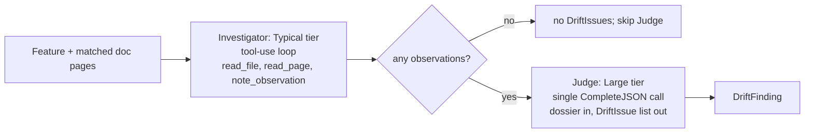

# Drift Detection — Decomposition Design

## Background

Drift detection (`internal/analyzer/drift.go`) currently runs a single agent loop per feature on the Large tier (Opus 4.7). The loop has three tools — `read_file`, `read_page`, `add_finding` — and is capped at 30 rounds. Every round is an Opus call.

This is expensive and slow:

- Opus tokens cover both adaptive investigation (read this file, then that one) and judgment (is this drift?). Investigation dominates the round count.
- The 30-round cap is hit on wide features ("Commit Range & History Analysis" was the trigger), at which point `len(findings)` may be 0 because the agent never reached the recording stage.
- Cross-feature work is sequential, so each feature's latency is paid in full.

## Goals

- **Cost.** Reduce Opus tokens per feature.
- **Latency.** Reduce wall-clock time per feature.

Reliability of findings (the 0-findings warning) and quality are explicit non-goals; either may improve as a side effect, but neither drove the design.

## Non-goals

- Cross-feature parallelism. The outer loop in `DetectDrift` stays sequential. If per-pass latency is still unacceptable after this lands, that is the next lever and is independent of this refactor.
- Retry policies on LLM failure. Status quo: any LLM error aborts the pass.
- Cross-feature finding deduplication.
- A user-facing flag or staged rollout. Internal pipeline change; no external contract moves.

## Design

Decompose drift detection into two stages per feature:

1. **Investigator** on the Typical tier (Sonnet 4.6 by default).
2. **Judge** on the Large tier (Opus 4.7 by default).



### Stage 1 — Investigator

Runs on `tiering.Typical()`. Same adaptive tool-use shape as today (`runAgentLoop` via `CompleteWithTools`). Tool set:

- `read_file` — unchanged.
- `read_page` — unchanged.
- `note_observation` — replaces `add_finding`. Records evidence, not findings.

`note_observation` parameters:

```
{
  "page":       string,  // doc URL, or "" if page-agnostic
  "doc_quote":  string,  // verbatim passage from the doc
  "code_quote": string,  // verbatim excerpt from the source
  "concern":    string   // one sentence: what looks off
}
```

Both quotes are required. They are what the Judge sees; without them, the dossier is unauditable and the Judge cannot adjudicate without re-reading.

The investigator's prompt instructs it to surface candidates, not commit to findings. Termination is unchanged: plain-text response ends the loop; round-cap exceeded returns whatever was accumulated.

Round cap raised from 30 to 50. Sonnet rounds are cheap enough to absorb.

### Stage 2 — Judge

One `CompleteJSON` call per feature on `tiering.Large()`. No tools. No loop. The prompt contains the feature metadata and the list of observations:

```
Feature: <name>
Description: <description>

Candidate drift observations from investigation:
[1] page: <url>
    docs say: "<doc_quote>"
    code shows: "<code_quote>"
    concern: <concern>
[2] ...

For each observation, decide: real drift, false alarm, or duplicate of another.
Emit one DriftIssue per real drift. Merge duplicates. Drop false alarms.
Refine the issue text to be actionable documentation feedback.
```

Output schema:

```
{ "issues": [ { "page": string, "issue": string } ] }
```

Same `DriftIssue` shape the rest of the pipeline already consumes. No downstream change.

### Cost shape

| | Today | New |
|---|---|---|
| Per-feature Opus rounds | up to 30 | 1 (or 0 if no observations) |
| Per-feature Sonnet rounds | 0 | up to 50 |
| Tokens carried into Opus | full agent transcript including file contents | only the observation list (quotes + concern) |

The Opus prompt stays small because file contents only ever enter the Sonnet conversation. Only the quotes the investigator chose to highlight reach Opus.

### Tier validation

The "Large tier must support tool use" requirement (`internal/cli/tier_validate.go`) shifts to Typical. After this change:

- Typical: Anthropic or OpenAI required (tool use).
- Large: any provider (no tool use).

This is a tightening on Typical and a loosening on Large. Users who configured Typical as Ollama for cheap classification will need to point it at a tool-use-capable provider, or the validator will reject. Since Typical is currently used only by `ExtractFeaturesFromCode` (which doesn't use tools), nothing in the existing prod path breaks — but configurations may.

## Failure modes

- **Investigator round cap exceeded.** Pass accumulated observations to the Judge. Log a warning naming the feature and observation count. The "0 findings on cap-hit" failure mode is structurally absent: the Judge runs on whatever observations exist, and if zero, we short-circuit.
- **Investigator hard error** (network, context cancel, panic). Propagate; abort the drift pass. Status quo.
- **Judge call error** (network, rate limit, malformed JSON). Propagate; abort the drift pass. Status quo for any per-feature LLM failure.
- **Empty observations.** Skip the Judge call entirely; feature contributes no findings. This is the legitimate "no drift detected" signal.

## Tests

- `internal/analyzer/drift_test.go` — update tier-routing assertions: investigator uses `Typical()` (not `Large()`); Judge uses `Large()` non-tool path. New cases: N observations → N entries in Judge prompt; investigator round cap → Judge still called; zero observations → Judge not called (call counter); Judge error → propagated.
- `internal/cli/tier_validate.go` tests — tool-use requirement on Typical, not Large. Error message names "typical".
- `internal/analyzer/tieringhelpers_test.go` — fake-tiering helper wires the new tool-use stub into Typical and a non-tool stub into Large.
- `cmd/find-the-gaps/testdata/*.txtar` — unchanged. External contract (`DriftFinding` shape, exit codes, report format) is preserved.

## What we explicitly did not design

- **Cheaper investigator** (Haiku/Small). Rejected: investigations are adaptively deep, Haiku is shaky on multi-step search.
- **Per-observation Opus calls.** Rejected: parallelism savings are dominated by per-call overhead at this granularity, and Opus loses cross-observation context (can't merge duplicates).
- **Uncertainty-gated escalation.** Rejected: adds a knob, not justified by the goals.
- **Cross-feature parallelism.** Out of scope; called out as the next lever if needed.

## Migration

Single PR, no flag, no staged rollout. User-visible deltas:

1. Tier validation error message wording: "typical" instead of "large" for tool use.
2. README / CLI help text mentioning which tier needs tool use (if any) — to be grepped during implementation.
3. Warning log line wording: "drift investigator exceeded N rounds for feature X; handing K observations to judge".
